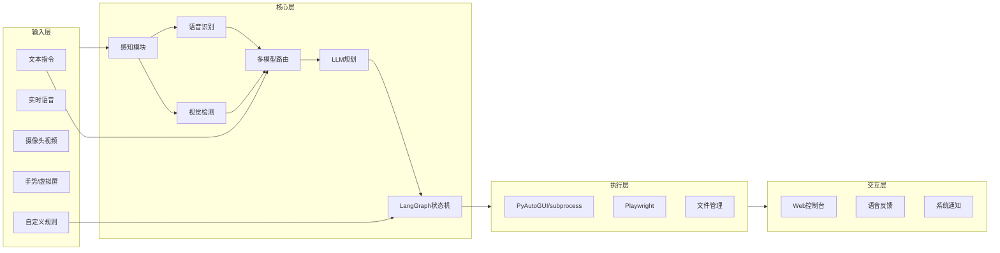

# 灵枢 SenseHub 产品与技术规格（SPEC）

> **文档版本**：v1.0（商业化交付版）  
> **适用平台**：Windows 10 / 11  
> **关联文档**：[档位说明](TIERS.md) · [架构说明](ARCHITECTURE.md)

## 1. 项目概述

| 项 | 说明 |
|----|------|
| **名称** | 灵枢 SenseHub Agent |
| **定位** | Windows 本地多模态智能体套件：Console 执行 + Studio 对话 + Code 编程 |
| **部署形态** | 本地常驻服务（Python 后端）+ 本机 / 局域网 Web 控制台；默认不暴露公网 |
| **核心闭环** | 感知（视 / 听 / 屏 / 指令）→ 理解（LLM + 规则）→ 规划 → 执行（桌面 / 网页）→ 反馈（截图 / 状态 / 语音） |



---

## 2. 功能清单

### 2.1 文本指令控制

| 能力 | 说明 | 示例 |
|------|------|------|
| 自然语言任务 | 解析意图并多步执行 | 「打开浏览器搜索课程资料」 |
| 结构化快捷命令 | 支持别名与参数 | `/open chrome`、`/screenshot` |
| 任务状态查询 | 查看当前/历史任务 | 「现在在做什么？」 |
| 任务中断/取消 | 安全停止执行链 | 「停止」 |
| 确认门控 | 高风险操作需二次确认 | 删除文件、关机、发送邮件 |

### 2.2 实时语音控制

| 能力 | 说明 | 技术候选 |
|------|------|----------|
| 唤醒词（可选） | 「灵枢」等本地 VAD + 关键词 | WebRTC VAD / Porcupine |
| 流式 ASR | 边说边识别，低延迟 | Whisper.cpp / FunASR |
| 语音活动检测 | 过滤环境噪声 | Silero VAD |
| 语音反馈 TTS | 执行结果播报 | Edge TTS / Azure TTS |
| 语音快捷命令 | 固定短语直达动作 | 规则引擎映射表 |

**档位限制**：Lite = Whisper small + 10 条快捷命令；Pro = 更大模型 + 流式；Max = FunASR/Whisper large + 自定义唤醒词。

### 2.3 视频感知与视觉决策

| 能力 | 说明 | 技术候选 |
|------|------|----------|
| 摄像头采集 | 实时帧获取与预览 | OpenCV |
| 人体/物体检测 | 人员出现、物体识别 | Ultralytics YOLOv8/v11 |
| 基础手势 | 挥手、举手、指向 | YOLO Pose / MediaPipe Hands |
| 场景事件规则 | 人出现提醒、离岗检测 | 规则引擎 + 置信度阈值 |
| 视觉上下文注入 LLM | 关键帧供规划参考 | 多模态 LLM / VLM |
| 执行后视觉验证 | 截图/OCR 确认 | mss + pytesseract / 视觉 LLM |

### 2.4 虚拟屏幕与空中手势（Max）

| 能力 | 说明 |
|------|------|
| 虚拟屏幕投影 | 摄像头画面上叠加半透明 UI 区域 |
| 手部追踪 | 食指指尖映射到虚拟屏坐标 |
| 空中点击 / 滑动 | 捏合或停留触发 click / drag |
| 校准流程 | 四点 / 九点校准，持久化变换矩阵 |
| 安全区 | 仅映射 Web 控制台指定区域 |

技术栈：MediaPipe Hands + OpenCV 透视变换 + 防抖算法。**仅 Max 套餐开放。**

### 2.5 桌面与网页自动化执行

| 类别 | 具体能力 | 工具 |
|------|----------|------|
| 应用启动 | 打开/关闭/切换程序 | subprocess、Windows start |
| 键鼠操作 | 点击、输入、快捷键 | PyAutoGUI（含 failsafe） |
| 窗口管理 | 聚焦、最大化 | pywin32 / pygetwindow |
| 网页操作 | 打开 URL、填表、搜索 | Playwright |
| 文件管理 | 列举/复制/移动（白名单） | pathlib |
| 屏幕截图 | 全屏/窗口/区域 | mss / PIL |
| 剪贴板 | 读写（需确认） | pyperclip |

**v1 明确不做**：内核级驱动注入、绕过 UAC、未授权远程 Shell。

### 2.6 自定义规则引擎

| 规则类型 | 触发条件 | 动作 |
|----------|----------|------|
| 人员出现提醒 | YOLO 检测到人 | 通知 / TTS / Web 推送 |
| 手势触发 | 特定手势持续 N 帧 | 执行预定义宏 |
| 语音快捷 | 精确匹配短语 | 跳过 LLM 直接执行 |
| 定时/周期 | Cron 表达式 | 截图、打开应用 |
| 组合条件 | AND/OR 多模态 | 有人 + 说「开始录制」 |

规则存储：本地 YAML/JSON；Web UI 可视化编辑；导入/导出。示例见 [`config/rules.example.yaml`](../config/rules.example.yaml)。

### 2.7 LLM 多模型路由

| 角色 | 职责 | 候选模型 |
|------|------|----------|
| intent | 分类、实体提取 | GPT-4o-mini / DeepSeek-V3 / Qwen-Turbo |
| planner | 生成多步计划 JSON | Claude Sonnet / GPT-4o / DeepSeek-R1 |
| coder | Playwright 选择器、脚本 | GPT-4o / DeepSeek-Coder |
| vision | 截图/帧描述 | GPT-4o / Qwen-VL / Gemini |
| safety | 拦截危险计划 | 独立小模型 + 规则双重校验 |

**路由策略**：
- 配置驱动（`config/models.yaml`）
- 失败降级：主模型 → 备用模型 → 本地规则
- 敏感操作：规划与审查模型分离

### 2.8 LangGraph 任务编排

- **状态字段**：`task_id`、`intent`、`plan_steps[]`、`current_step`、`context`、`status`（pending/running/wait_confirm/done/failed）
- **节点**：`plan` → `confirm`（可选）→ `execute` → `verify` → `report`
- **持久化**：SQLite checkpoint，支持断点续执行
- **并发**：单任务串行；感知模块并行采集
- **人机协同**：`wait_confirm` 暂停，Web UI 展示计划待批准

### 2.9 Web 控制台 UI

**设计总纲**：见 **[UI_DESIGN.md](UI_DESIGN.md)**（双主题、全 Phase 路由、多模态布局槽位、档位 TierGate 策略）。

**设计风格**：深色/浅色双主题；Dashboard 控制台布局；shadcn/ui + Tailwind。

| 页面/组件 | 功能 |
|-----------|------|
| Dashboard | Agent 状态、当前任务、快捷指令 |
| 指令输入 | 文本框 + 语音按钮 |
| 任务时间线 | 步骤进度、日志、截图 |
| 摄像头预览 | 实时画面、检测框、虚拟屏校准 |
| 规则管理 | CRUD、测试触发 |
| 模型与档位 | 套餐、API Key 配置 |
| 安全中心 | 会话、IP 白名单、审计日志 |
| 设置 | 设备、灵敏度、确认策略 |

**技术栈**：React + Vite + Tailwind + shadcn/ui · WebSocket · FastAPI

---

## 3. 商业化档位边界

详见 **[TIERS.md](TIERS.md)**。对外四档 **Lite · Standard · Pro · Max**，运行时三档 **lite · pro · max**。

| 维度 | Lite | Standard | Pro | Max |
|------|------|----------|-----|-----|
| 生效档位 | lite | pro | pro | max |
| 文本指令 | 20 次/日 | 不限 | 不限 | 不限 |
| Token 额度（约） | 50 万/月 | 150 万/月 | 500 万/月 | 2000 万/月 |
| 语音流式 / 手势 | — | ✓ | ✓ | ✓ |
| 虚拟屏 / 多脑协作 | — | — | — | ✓ |
| 专属 API Key | 仅自有 | 仅自有 | 平台签发 | 平台签发 |
| 规则上限 | 3 条 | 50 条 | 50 条 | 不限 |

授权：用户订阅状态 + 积分兑换；功能门控在 `sensehub/licensing/` 与 API 中间件统一拦截。

---

## 4. 安全规范

### 4.1 威胁模型

- 局域网未授权访问 Web 控制台
- API Key 泄露
- 提示注入导致危险自动化
- 恶意规则/宏执行
- 语音/视频误触发

### 4.2 安全措施

| 措施 | 实现要点 |
|------|----------|
| 身份认证 | 主密码 + JWT + HttpOnly Cookie |
| 网络绑定 | 默认 127.0.0.1；局域网需显式开启 + IP 白名单 |
| TLS | mkcert 自签证书 |
| API Key 存储 | Windows DPAPI 加密 vault |
| 操作分级 | L0 只读 / L1 常规 / L2 需确认 / L3 禁止 |
| 路径白名单 | 文件操作限制指定目录 |
| 命令黑名单 | 禁止 format、批量注册表修改等 |
| LLM 输出审查 | JSON Schema + 安全审查节点 |
| 速率限制 | 防暴力登录与指令洪水 |
| 审计日志 | 谁、何时、输入、执行、结果 |
| Kill Switch | 快捷键 + Web 按钮，立即停止 PyAutoGUI |

策略模板：[`config/policies.yaml.example`](../config/policies.yaml.example)

### 4.3 隐私

- 摄像头/麦克风默认关闭，需用户授权
- 视频帧默认不上传云端；仅 VLM 调用时发送
- 截图/录音保留策略可配置

---

## 5. 外部软件与依赖

### 5.1 运行时依赖

| 组件 | 用途 | 许可 |
|------|------|------|
| Python 3.11+ | 主运行时 | PSF |
| OpenCV | 摄像头 | Apache 2.0 |
| Ultralytics YOLO | 检测 | AGPL-3.0（商用需注意） |
| MediaPipe | 手部追踪 | Apache 2.0 |
| faster-whisper | ASR | MIT |
| FunASR | 中文 ASR | MIT |
| LangGraph + LangChain | 编排 | MIT |
| PyAutoGUI | 桌面自动化 | BSD |
| Playwright | 浏览器 | Apache 2.0 |
| FastAPI + Uvicorn | API | MIT |
| SQLite | 状态/日志 | Public Domain |

### 5.2 系统级依赖

Windows 10/11、摄像头/麦克风驱动、Chromium（Playwright）、VC++ Redistributable、可选 CUDA。

### 5.3 外部 API（用户配置）

OpenAI、Anthropic、DeepSeek、通义、千帆、Gemini、Edge TTS（无需 Key）。

### 5.4 开发工具

Git、Ruff、pytest、Node.js 20+。

完整安装步骤见 [`SETUP.md`](SETUP.md)。

---

## 6. 项目目录结构

```
SenseHub-Agent/
├── docs/                  # 规格与指南
├── config/                # 配置模板与本地配置
├── sensehub/
│   ├── perception/        # 摄像头、ASR、视觉
│   ├── cognition/         # LLM 路由、规划
│   ├── orchestration/     # LangGraph
│   ├── execution/         # 桌面、浏览器、文件
│   ├── rules/             # 规则引擎
│   ├── security/          # 认证、审计
│   ├── licensing/         # 档位门控
│   └── api/               # FastAPI、WebSocket
├── web/                   # React 前端
├── scripts/smoke/         # 冒烟测试
├── tests/
├── pyproject.toml
└── README.md
```

---

## 7. 非功能性要求

| 指标 | 目标（v1） |
|------|-----------|
| 文本指令首步规划 | < 3s |
| 语音端到端（Pro） | < 2s |
| 视频检测（720p GPU） | < 200ms/帧 |
| 内存 | Lite < 2GB；Pro < 4GB |
| 安装包 | Lite < 500MB（模型外置） |
| 可用性 | 崩溃自动重启（Windows 服务） |

---

## 8. 版本里程碑

| 阶段 | 内容 | 状态 |
|------|------|------|
| Phase 0 | 规格文档、脚手架、环境验收 | 已交付 |
| Phase 1 | 文本指令、任务编排、桌面 / 网页执行、Web 控制台、基础安全 | 已交付 |
| Phase 2 | 摄像头、YOLO、Whisper、规则引擎、多模型路由 | 已交付 |
| Phase 3 | Standard / Pro：流式 ASR、手势、TTS、局域网、安全中心 | 已交付 |
| Phase 4 | Max：虚拟屏、VLM 验收、多 Agent 协作 | 已交付 |
| 商业化 v1.0 | 四档 Token Plan、Console / Studio / Code 产品线、交付文档 | **当前版本** |

---

## 9. 编码与配置约定

- **编码**：Python PEP 8 + Ruff；TypeScript strict
- **配置**：环境变量 + YAML；禁止硬编码密钥与绝对路径
- **路径加载**：统一从 `config/paths.yaml` 读取
- **日志**：结构化 JSON，敏感字段脱敏
- **错误**：用户可读消息 + 内部 `trace_id`
- **国际化**：v1 中文为主，文案外置 `i18n/`
- **许可**：核心 MIT；YOLO AGPL 商用需合规评估

---

## 相关文档

- [环境预配置](SETUP.md)
- [冒烟测试](SMOKE_TESTS.md)
- [档位对照](TIERS.md)
- [架构与接口](ARCHITECTURE.md)
- [成员分工](TEAM.md)
- [UI 设计总纲](UI_DESIGN.md)
- [Cursor Skill 规划](SKILLS.md)
